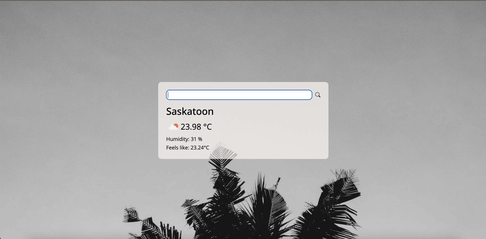

# WEATHER APP

Weather application that utilizes open weather API to get weather infromation. Users can search for weather inforamtin by filling the input field and subiting the form. Background for this program uses Unsplash random images API. 




## Tools Used

**APIs**: Opean weather, Unsplash, OpenCage \
**Tools**: React, Javascript, HTML, CSS

## Running Locally
1. Clone repository
```cmd
$ git clone git@github.com:gurung69/WeatherApp.git
```
2. Get API Key from Open Weather

3. Replace the value for key in index.js with API key